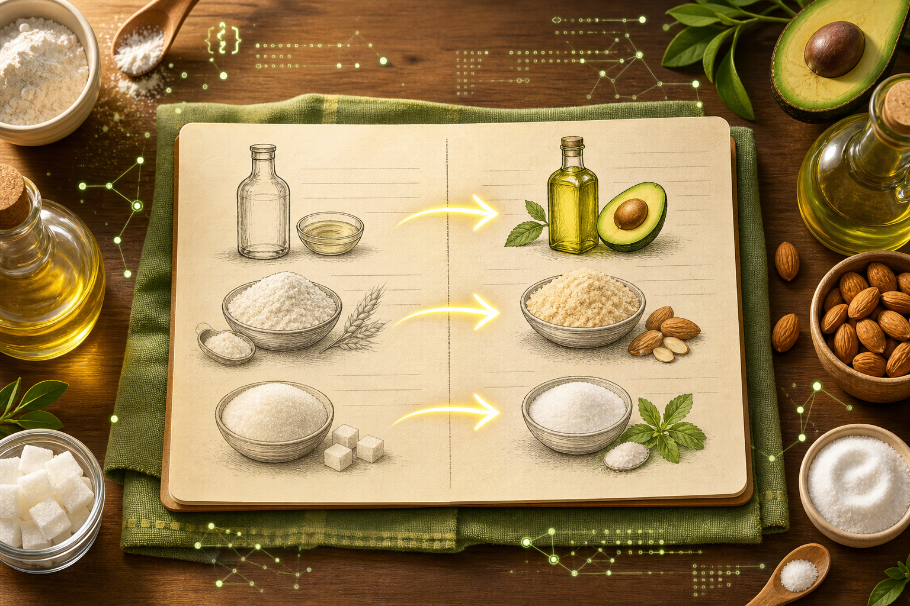

# Recipe Healthifier — Modern Java for Healthier Home Cooking



## Short description

Recipe Healthifier is a Java 26 command-line application that reads a recipe from a text file or webpage, applies health-focused ingredient substitutions, explains every change, reports rule compliance, and optionally saves the converted recipe in a local library.

## The problem

Changing how a household eats sounds simple until every recipe must be checked ingredient by ingredient. Seed oils, gluten, dairy, ultra-processed foods, and carbohydrate-heavy ingredients can hide in otherwise familiar meals. Reworking quantities and remembering substitutions adds friction at exactly the moment someone is trying to cook.

Recipe Healthifier turns that repetitive review into a transparent local workflow. A cook selects goals such as `KETO`, `GLUTEN_FREE`, or `NO_SEED_OILS`; the application produces a revised recipe, identifies each swap, preserves the instructions, and flags custom avoidances it cannot resolve. It does not pretend to provide medical advice—the substitutions are practical starting points that the cook can review.

## What it does

- Accepts structured recipe text from a local file.
- Downloads recipe pages and extracts Schema.org `Recipe` JSON-LD.
- Applies deterministic, explainable ingredient swaps for eight health preferences.
- Reports compliant and unresolved constraints.
- Saves complete conversion results to a local JSON recipe library.
- Lists, displays, and deletes saved recipes.
- Runs as one executable modular JAR with no runtime libraries.

## Bill of materials

| Item | Purpose | Cost |
|---|---|---:|
| Computer running Windows, macOS, or Linux | Build and run the application | Existing device |
| Eclipse Temurin/OpenJDK 26 | Java compiler and runtime | Free |
| Maven Wrapper included in the repository | Repeatable build | Free |
| Internet connection | Optional URL recipe import | Existing connection |
| Text editor or terminal | Recipe input and interaction | Free |

No dedicated hardware, cloud account, API key, or paid service is required.

## Architecture

The project separates domain state, application orchestration, infrastructure adapters, and the CLI:

```text
Text file ──────────────┐
                       ├─> ConvertInput ─> IngestingConversionService
Recipe URL ─> HTTP/JSON-LD ┘                         │
                                                    v
                                      TextRecipeConversionService
                                         │                    │
                                         v                    v
                              SwapRuleRepository       ConversionResult
                                                               │
                                                               v
                                                     FileRecipeLibrary
```

The conversion core knows nothing about HTTP or files. Source readers normalize external input into text; a repository supplies substitution rules; and the result is an immutable domain value. This makes the behavior testable without network calls.

## Modern Java 26

The Maven build explicitly targets Java 26 using `<release>26</release>`. The implementation uses modern Java language and platform capabilities throughout:

- Records model immutable values such as conversion results, swaps, and saved entries.
- A sealed `ConvertInput` hierarchy represents text, URL, and image sources exhaustively.
- Pattern matching for `instanceof` dispatches source types safely.
- Switch expressions parse CLI options and JSON escapes clearly.
- Text blocks make recipe fixtures readable.
- The Java module system declares and exports application boundaries.
- `HttpClient` provides redirects, timeouts, and interruption-safe URL ingestion.
- `Stream.toList`, `List.copyOf`, `Set.copyOf`, and `Map.copyOf` create immutable snapshots.
- `Path`, atomic file moves, and a read/write lock provide durable local persistence.

## Build instructions

1. Install a Java 26 JDK and confirm it is active:

   ```powershell
   java -version
   ```

2. Clone or download the repository.

3. From the project directory, run:

   ```powershell
   .\mvnw.cmd clean verify
   ```

4. Confirm Maven reports `BUILD SUCCESS`. The executable is:

   ```text
   target/java-recipe-healthifier-1.0-SNAPSHOT.jar
   ```

On macOS or Linux, use `./mvnw clean verify` if the Unix wrapper is included, or `mvn clean verify` with Maven installed.

## Prepare a recipe

Create `recipe.txt`:

```text
Chocolate Cake
Servings: 8

Ingredients:
- 2 cups all-purpose flour
- 1 cup sugar
- 1/2 cup vegetable oil
- 2 eggs

Instructions:
1. Mix all ingredients.
2. Bake until set.
```

## Convert and save

```powershell
java -jar target/java-recipe-healthifier-1.0-SNAPSHOT.jar `
  --file recipe.txt `
  --rules KETO,GLUTEN_FREE,NO_SEED_OILS `
  --save
```

The output substitutes almond flour, allulose, and avocado oil, explains the changes, and prints the saved entry ID.

To import a public recipe page containing Schema.org Recipe metadata:

```powershell
java -jar target/java-recipe-healthifier-1.0-SNAPSHOT.jar `
  --url "https://example.com/recipe" `
  --rules DAIRY_FREE,NO_UPF
```

## Use the library

```powershell
# List
java -jar target/java-recipe-healthifier-1.0-SNAPSHOT.jar --library

# Show
java -jar target/java-recipe-healthifier-1.0-SNAPSHOT.jar --show <entry-id>

# Delete
java -jar target/java-recipe-healthifier-1.0-SNAPSHOT.jar --delete <entry-id>
```

The default store is `recipe-library.json`. Use `--library-file <path>` to choose another location.

## Reliability and safety

The application validates domain objects on construction and defensively copies collections. URL fetching follows normal redirects, uses connection/request timeouts, accepts HTML only, and limits responses to five million characters. Library updates use a temporary file and atomic replacement where supported, so an interrupted write is less likely to damage saved data.

The automated suite covers domain invariants, conversion behavior, JSON-LD shapes, source routing, repository filtering, persistence round trips, corruption handling, and complete CLI library workflows. Run all tests with `mvnw clean verify`.

## Limitations and next steps

- Ingredient matching is intentionally deterministic and phrase-based; it does not make medical or nutritional claims.
- URL import depends on the page exposing valid Schema.org Recipe JSON-LD.
- Image input exists in the domain model, but OCR is not included in this release.
- Future work could add nutrition databases, configurable rule packs, richer conflict resolution, and an accessible desktop interface.

## Why it matters

Recipe Healthifier addresses a daily health task without requiring an account or sending a household's recipes to a cloud service. Its explainable swaps keep the cook in control, while local persistence makes useful conversions easy to revisit. The project demonstrates how modern Java can combine strong domain modeling, networking, parsing, testing, and durable storage in a focused personal-living tool.
